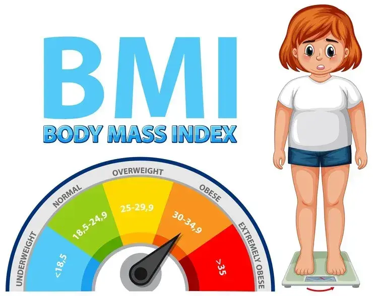

# 💪 BMI Calculator - Streamlit App

A sleek and responsive **Body Mass Index (BMI) Calculator** built using [Streamlit](https://streamlit.io/). This app allows users to enter their weight (in kilograms) and height (in feet) to compute their BMI and view the health category it falls under.

---

## 📸 Screenshot

---

## 🧮 Features

- 📏 Simple input interface for weight and height
- 📊 Real-time BMI calculation
- ✅ Clear BMI classification:
  - 🟡 Underweight
  - 🟢 Normal weight
  - 🟠 Overweight
  - 🔴 Obese
- 🎨 Stylish UI with dark mode aesthetics
- ⚙️ Fully responsive layout using Streamlit’s column layout

---

## 🚀 How to Run the App

1. **Install Streamlit (if not already installed)**  
pip install streamlit

markdown
Copy
Edit

2. **Save the Python file** (e.g., `bmi_app.py`) and place the `bmi.png` image in the same directory.

3. **Run the app**  
streamlit run bmi_app.py

yaml
Copy
Edit

---

## 📂 Project Structure

bmi_calculator/ │ ├── bmi_app.py # Main Streamlit App ├── bmi.png # Sidebar image └── README.md # You're reading it!

yaml
Copy
Edit

---

## 🧠 BMI Categories Explained

| BMI Range       | Category       |
|------------------|----------------|
| Below 18.5       | 🟡 Underweight  |
| 18.5 - 24.9       | 🟢 Normal       |
| 25 - 29.9         | 🟠 Overweight   |
| 30 and above      | 🔴 Obese        |

---

## 📌 Notes

- Height input is in **feet**, which is automatically converted to meters.
- Weight is input in **kilograms**.
- You can customize the background, fonts, and styling using the `<style>` section inside the code.

---

## 🛠️ Built With

- Python 🐍
- Streamlit 🎈
- HTML/CSS (for styling in markdown)

---

## ✨ Author

Created with ❤️ by [Arjumand] 